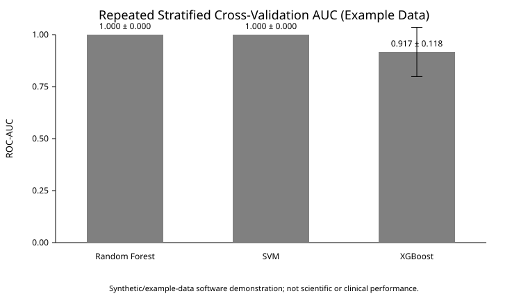

# Machine Learning Pipeline for Alzheimer's Disease Gene Prediction

## Overview

This portfolio repository presents a reproducible machine-learning demonstration for biological feature data, motivated by broader Alzheimer's disease bioinformatics work involving genomic, transcriptomic, and disease-gene association resources.

The **public repository intentionally focuses on a compact, executable demonstration** using an included example feature matrix. It is designed to show leakage-aware preprocessing, repeated cross-validation, model comparison, explainability, automated testing, continuous integration, workflow management, and HPC-oriented execution practices.

The public example data and generated outputs are for software demonstration only. They should **not** be interpreted as clinical validation, biological findings, or evidence for Alzheimer's disease mechanisms.

## What the Public Repository Implements

- CSV input loading with numeric, missing-value, finite-value, and binary-label validation;
- stratified hold-out evaluation;
- repeated stratified cross-validation;
- leakage-aware standardization and PCA inside scikit-learn pipelines;
- Random Forest, Support Vector Machine, and XGBoost classification;
- ROC-AUC, accuracy, classification-report, and CV summary export to JSON;
- figures generated from exported metrics;
- a SHAP explainability demonstration on the example feature matrix;
- pytest-based automated tests;
- GitHub Actions continuous integration;
- a Snakemake workflow; and
- a generic SLURM submission example.

## Public Data Scope

The executable demo uses:

```text
data/example_feature_matrix.csv
```

The included matrix is intentionally small so the repository can run quickly without distributing research-scale biological data. The label column is binary (`0`/`1`). See `data_description.md` for the distinction between the executable public demo and broader project context.

## Reproducible Example Results

The committed example snapshot was generated from the included example matrix using 3-fold repeated stratified cross-validation with 2 repeats (6 validation folds total).

| Model | CV ROC-AUC, mean ± SD | CV accuracy, mean ± SD |
|---|---:|---:|
| Random Forest | 1.000 ± 0.000 | 1.000 ± 0.000 |
| Support Vector Machine | 1.000 ± 0.000 | 1.000 ± 0.000 |
| XGBoost | 0.917 ± 0.118 | 0.917 ± 0.118 |



These scores are **software-demo results on a tiny, strongly separated example dataset**. They are useful for confirming pipeline behavior, not for estimating Alzheimer's prediction performance.

Machine-readable snapshot: [`results/example_model_metrics.json`](results/example_model_metrics.json)

## Technologies

- Python
- pandas / NumPy
- scikit-learn
- XGBoost
- matplotlib
- SHAP
- pytest
- Snakemake
- GitHub Actions
- Linux/HPC
- SLURM
- Git/GitHub

## Repository Structure

```text
alzheimers-gene-prediction-ml/
├── .github/workflows/ci.yml
├── README.md
├── data_description.md
├── requirements.txt
├── data/
│   └── example_feature_matrix.csv
├── src/
│   ├── model_pipeline.py
│   ├── visualize_results.py
│   └── explain_model.py
├── tests/
│   └── test_model_pipeline.py
├── hpc/
│   └── run_model.slurm
├── workflow/
│   ├── Snakefile
│   └── config.yaml
├── examples/
│   └── go_enrichment_template.md
├── figures/
│   └── model_cv_auc_comparison.svg
├── results/
│   ├── example_model_metrics.json
│   └── results_summary.md
├── reports/
├── notebooks/
└── LICENSE
```

## How to Run

### 1. Create an environment

```bash
git clone https://github.com/Hemalatha18-bio/alzheimers-gene-prediction-ml.git
cd alzheimers-gene-prediction-ml
python -m venv .venv
source .venv/bin/activate
pip install -r requirements.txt
```

On Windows, activate with `.venv\Scripts\activate`.

### 2. Run model evaluation

```bash
python src/model_pipeline.py \
  --input data/example_feature_matrix.csv \
  --pca-components 2 \
  --cv-splits 3 \
  --cv-repeats 2 \
  --output results/model_metrics.json
```

Scaling and PCA are fitted **inside each model pipeline**, including within cross-validation folds. This prevents preprocessing from being learned from validation data.

The JSON output contains one illustrative hold-out result plus repeated-CV mean/standard-deviation summaries. For small datasets, the repeated-CV values are generally more informative than a single hold-out split, although neither should be treated as biological validation here.

### 3. Generate model-comparison figures

```bash
python src/visualize_results.py \
  --metrics results/model_metrics.json \
  --output-dir figures
```

The visualization code reads generated metrics rather than hard-coded performance values.

### 4. Run the SHAP demonstration

```bash
python src/explain_model.py \
  --input data/example_feature_matrix.csv \
  --output figures/shap_summary.png
```

The SHAP output is a methodological illustration using example data and should not be interpreted as biological evidence.

### 5. Run tests

```bash
pytest -q
```

Tests cover input validation, invalid evaluation settings, model outputs, and repeated-CV metrics. GitHub Actions runs the suite automatically on pushes and pull requests targeting `main`.

### 6. Run with Snakemake

```bash
snakemake --snakefile workflow/Snakefile --cores 1
```

The workflow connects the example feature matrix to model training and visualization. Configuration is stored in `workflow/config.yaml`.

### 7. HPC / SLURM example

A generic submission script is provided at `hpc/run_model.slurm`. Cluster-specific modules, environments, paths, account/partition settings, and resource requests should be adapted to the target HPC system.

## Broader Project Experience

The broader work that motivated this repository involved experience with genomic and transcriptomic data integration, disease-gene association resources, high-dimensional feature processing, dimensionality reduction, machine-learning experimentation, biological interpretation, enrichment-analysis concepts, and Linux/HPC execution.

Those activities are **broader project context and are not all reproduced by this public repository**. Quantitative claims from broader work are intentionally not presented here unless the supporting data and analysis are publicly reproducible.

## Gene Ontology Enrichment Template

`examples/go_enrichment_template.md` documents information a reproducible enrichment analysis should record, including the input gene list, identifier type, background universe, multiple-testing correction, database/tool versions, and machine-readable outputs. It is a documentation template, not an Alzheimer's enrichment result.

## Limitations

- The public demo uses a tiny example matrix rather than a research-scale cohort.
- Repeated cross-validation improves the evaluation demonstration but does not create biological or clinical validity.
- The repository does not reproduce the complete original biological data-integration workflow.
- Example-data SHAP outputs are methodological illustrations, not biological findings.
- External validation would be required before scientific or clinical conclusions.

## Possible Future Extensions

- Add hyperparameter tuning nested within cross-validation.
- Add a larger fully public biological dataset with documented accession/source information.
- Add calibration and precision-recall evaluation where appropriate.
- Add a fully reproducible enrichment implementation using a public gene list and defined background universe.
- Pin a release environment for a stable portfolio snapshot.

## Skills Demonstrated

Python scientific programming, machine-learning pipeline construction, leakage-aware preprocessing, repeated stratified cross-validation, model evaluation, input validation, explainability, automated testing, CI, workflow management, reproducibility practices, result visualization, Git/GitHub organization, and Linux/HPC/SLURM familiarity.

## Author

Hemalatha Ponnam  
M.S. Bioinformatics & Computational Biology  
Saint Louis University
